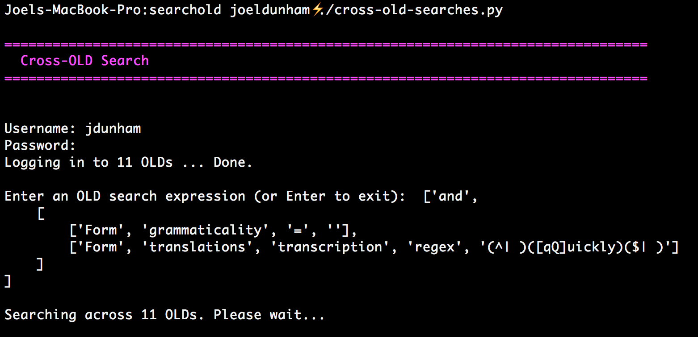
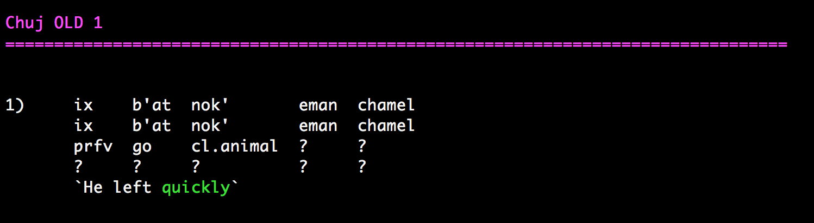
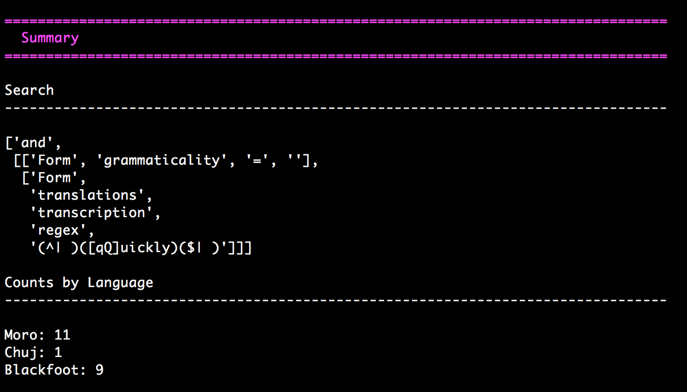

================================================================================
  Cross-OLD Searches
================================================================================

Asynchronous cross-linguistic, multi-OLD command-line searching!

This script performs searches across multiple OLDs from the command line and
prints them to stdout.

The OLD (Online Linguistic Database) is software for linguistic fieldwork. The
OLD is used to build RESTful web services that allow you to build and query
databases of linguistic fieldwork data over the Internet. See
http://www.onlinelinguisticdatabase.org.

Usage
================================================================================

::

    $ ./cross-old-searches.py

The script will prompt you for your username and password. Note that you must
have the same username and password for all of the OLDs you are searching over,
which is a good idea anyways.

Change `OLDS` and `LANGUAGES` below to match the OLDs that you have access to.

Example Search
================================================================================

This search will return all grammatical forms that contain the word "quickly"
in one of their translation values.::

    ['and',
        [
            ['Form', 'grammaticality', '=', ''],
            ['Form', 'translations', 'transcription', 'regex', '(^| )([qQ]uickly)($| )']
        ]
    ]

Screenshots
================================================================================

Dependencies
================================================================================

Python Twisted must be installed.

